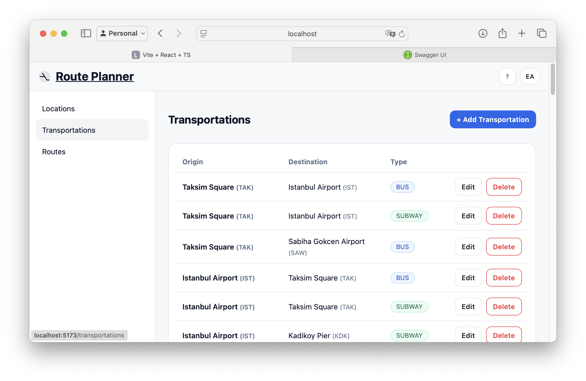

# ✈️ Route Planner – Full Stack Java Application

A full-stack case study project designed for the **aviation industry**.  
The system calculates **all valid routes** between two locations (with rules around flights and transfers), while also providing full **CRUD functionality** for locations and transportations.  

The project contains:  
- **Backend** → Spring Boot REST API with Hibernate & H2.  
- **Frontend** → React + TypeScript SPA with a clean UI.  

---

## Features
- **CRUD for Locations** (name, city, country, code)  
- **CRUD for Transportations** (BUS, SUBWAY, UBER, FLIGHT)  
- **Route Calculation Engine**  
  - Max 3 legs per route  
  - Exactly 1 flight required  
  - Optional transfer before/after the flight  
- **Swagger UI** for API documentation  
- **Responsive Frontend** with sidebar navigation  
  - Locations page  
  - Transportations page  
  - Routes page (search with dropdowns, route list + details)  

---

## Tech Stack
**Backend**
- Java 17  
- Spring Boot (Web, Validation, Data JPA)  
- Hibernate ORM  
- H2 in-memory DB (can be swapped to PostgreSQL/MySQL)  
- Swagger (springdoc-openapi)  

**Frontend**
- React + TypeScript  
- Vite  
- React Query  
- Tailwind-inspired CSS  

---

## Screenshots
| Routes Page | Locations | Transportations |
|-------------|-----------|-----------------|
|  |  |  |

More:
-   
-   

---

## Backend Setup
```bash
# Run Spring Boot backend
./mvnw spring-boot:run
```
- Base URL: `http://localhost:8080`  
- Swagger UI: `http://localhost:8080/swagger-ui.html`  
- H2 Console: `http://localhost:8080/h2-console`  

👉 Default data is auto-loaded from [`data.sql`](./src/main/resources/data.sql).

---

## Frontend Setup
```bash
# Go to frontend folder
cd frontend

# Install dependencies
npm install

# Start dev server
npm run dev
```
- App runs at: `http://localhost:5173`  
- API requests proxy to: `[http://localhost:8080/api](http://localhost:8080/swagger-ui/index.html)`

---

## Sample Data
**Locations**
- Taksim Square (TAK)  
- Istanbul Airport (IST)  
- Sabiha Gokcen Airport (SAW)  
- London Heathrow Airport (LHR)  
- Wembley Stadium (WEM)  

**Transportations**
- TAK → IST (BUS, SUBWAY)  
- TAK → SAW (BUS)  
- IST → LHR (FLIGHT)  
- SAW → LHR (FLIGHT)  
- LHR → WEM (BUS, UBER)  

👉 Full dataset: [`data.sql`](./src/main/resources/data.sql)

---

## API Endpoints
- `GET /api/locations` – list locations  
- `POST /api/locations` – add location  
- `GET /api/transportations` – list transportations  
- `POST /api/transportations` – add transportation  
- `GET /api/routes?origin=TAK&destination=WEM` – find valid routes  

---

## Tests
- Unit & integration tests for `RouteService`  
- Valid vs invalid route scenarios covered  

---

## Nice-to-Haves
- Global exception handler with custom messages  
- Postman collection for CRUD & routes  
- Bonus: **Operating Days** field for transportations (with date filtering)  

---

## Author
Emir Ay (Developed as part of the **Java Full Stack Development Case Study**).  
